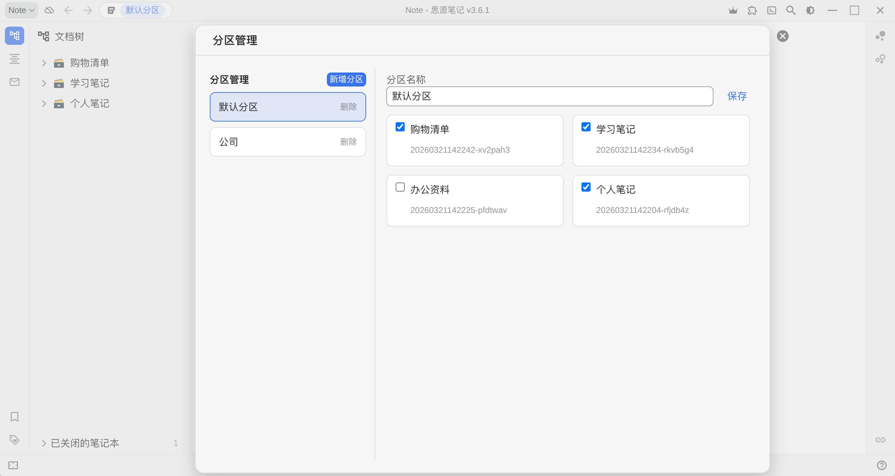

# SiYuan Note Partition

[中文版](./README_zh_CN.md)

SiYuan Note Partition is a SiYuan plugin that provides workspace-like partitions without switching real SiYuan workspaces. The current product model uses top-level notebook association only.



## Project Positioning

- Simulate workspace switching with partitions
- Let each partition maintain its own associated top-level notebooks
- Control visibility by opening notebooks in the active partition and closing unrelated notebooks
- Do not provide security isolation, encryption, or true workspace separation

## Current Features

- Create a default partition on first use and associate it with all current top-level notebooks
- Add, delete, and rename partitions
- Manage partition-to-notebook associations
- Always keep at least one partition; the last partition cannot be deleted
- Provide a left top-bar entry showing `icon + current partition name`
- Support quick switching and opening the management dialog from the top-bar menu
- Apply notebook visibility on partition switch
- Automatically associate newly created top-level notebooks with the active partition

## Current Boundaries

- Only top-level notebook filtering is supported
- No path-level filtering
- No note-level association
- The left top-bar button is the only main entry; there is no left Dock entry

## Tech Stack

- TypeScript
- Svelte 4
- Vite 5
- Sass
- SiYuan Plugin API (`siyuan`)

## Development

```bash
pnpm install
pnpm run dev
```

## Docs

- Detailed design: [docs/feature-design.md](./docs/feature-design.md)
- Codex reference: [AGENTS.md](./AGENTS.md)

## References

- SiYuan community docs: https://docs.siyuan-note.club/zh-Hans/reference/
- Plugin Quick Start: https://ld246.com/article/1723732790981
- SiYuan Plugin API: https://github.com/siyuan-note/petal
- Official plugin sample: https://github.com/siyuan-note/plugin-sample
- Reference plugin idea: https://github.com/zxkmm/siyuan_fake_workspace
